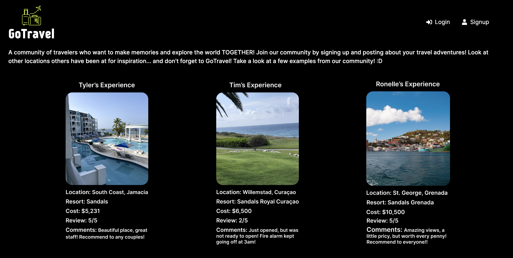

# GoTravel 

A responsive full stack (MERN) web application to allow users to post about their travel experiences, save them in a personal dashboard, as well as having access to other's expereince for future travel inspirations. 

Users can sign up/login, make posts with pictures, and search others experiences by location!

**Link to project:** https://gotravel-tb.cyclic.app/

 

## How It's Made:

**Tech used:** React, Redux, Node/Express, MongoDB, Tailwind, JWT, HTML, CSS

This web application was created with React on the frontend and Redux for state management. Node/Express was used to create the backend server, using MVC achitecture, with encryption of the passwords, while connecting to MongoDB for database. 

## Optimizations

This project can easily be expanded and optimized for increased user interaction. 

Future optimizations include: 

- Creating the functionalitiy to save and comment on other user's posts. 
- Adding direct messages for users to be able to communicate with each other and ask more specific questions about their experiences. 
- Creating the option for a light mode 

## Lessons Learned:

I learned a lot when creating this full stack web application by myself. I learned a lot about state management with Redux, using JWT, encrypting passwords, and authorization. 
